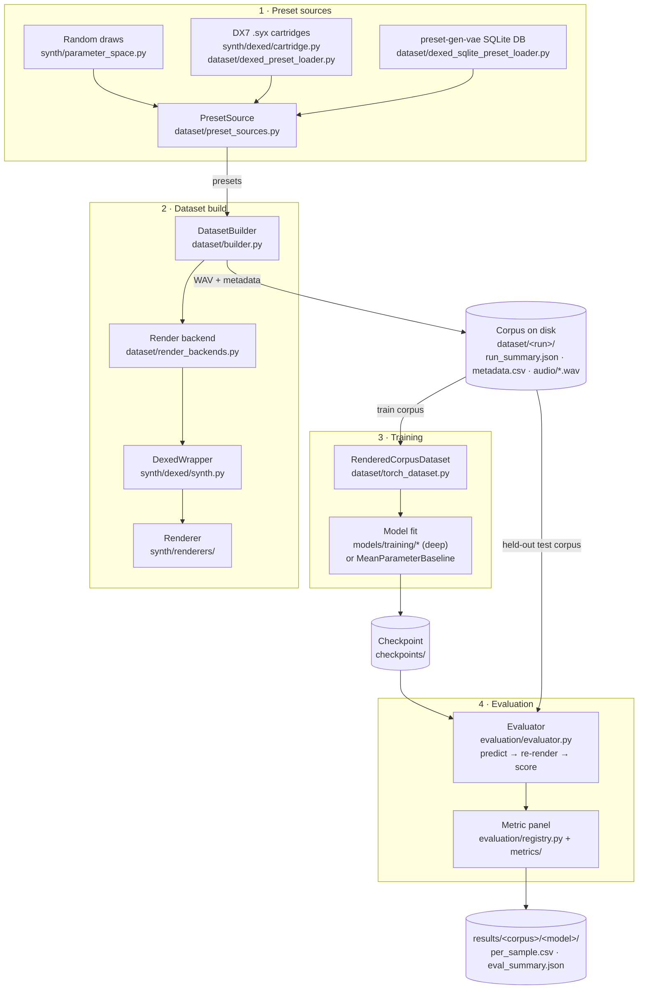

# Architecture — pipeline and module map

The framework renders Dexed (DX7) presets to audio, trains models to predict the
parameters back from that audio, and scores the predictions with a fixed metric panel.
This doc answers "what file does what, and in which order does data flow through them".

It states facts only. The *why* behind a design lives in [`DECISIONS.md`](DECISIONS.md)
(referenced inline by ID, e.g. D-REPRO); project terms are defined in
[`CONTEXT.md`](CONTEXT.md).

## Pipeline

A typical full run, script by script:

1. `scripts/build_dataset.py` (or `scripts/build_presetgen_corpus.py`) — build a corpus
   under `dataset/<run-name>/`.
2. `scripts/fit_model.py --model <family>` — fit any registered model family on the train
   corpus, save a checkpoint.
3. `scripts/evaluate.py` — load the checkpoint, score it on the held-out corpus, write
   `results/<corpus>/<model>/`.

Steps 1 and 3 need the Dexed VST locally (they render audio); step 2 does not — it reads
only the corpus on disk, so training can run on a cluster.

Every step can be driven either from the terminal (the scripts above) or from the local
Streamlit **dashboard**, which builds and subprocesses the exact same commands. See the
`dashboard/` section below.

## Module map

### `config.py`

Loads `.env` into module constants: VST paths, sample rate, note/render durations, output
directories. Everything else reads paths from here, never from `.env` directly.

### `synth/` — the synthesizer layer

| File | Purpose |
| --- | --- |
| `base_synth.py` | `BaseSynthesizer`, the interface every synth wrapper implements: get/set parameters by name, render mono audio, expose a `ParameterSpace`. |
| `parameter_space.py` | `ParameterSpace` + `ParameterSpecification`: the ordered set of estimated parameters and the two-way conversion between the synth-side dict (names → floats) and the ML-side vector (continuous values + one-hot blocks). Also owns `loss_slices` (routing for losses/metrics) and uniform sampling. |
| `dexed/synth.py` | `DexedWrapper`, the concrete Dexed implementation. Addresses parameters by plugin-reported name (D-NAMING) and delegates all rendering to a pluggable `Renderer`. |
| `dexed/subset.py` | The locked 103-parameter Dexed subset (D1). Builds the project's `ParameterSpace` from a live wrapper. |
| `dexed/cartridge.py` | Parses DX7 `.syx` cartridges (32-voice bulk dumps) into named Dexed parameter dicts, normalized the way Dexed normalizes them. |
| `renderers/base.py` | `Renderer`, the only engine-specific layer: enumerate parameters, set one by index, render a note. |
| `renderers/dawdreamer_renderer.py` | Default engine, backed by DawDreamer. |
| `renderers/pedalboard_renderer.py` | Second engine, backed by Pedalboard; used to cross-check renders (D-RENDERER). Never mixed with DawDreamer within a run. |

### `dataset/` — corpus building and loading

| File | Purpose |
| --- | --- |
| `preset_sources.py` | `PresetSource` decides *which* presets exist: synthetic (random draws), human (real presets projected onto the subset), or hybrid (a blend). Deterministic in the master seed. |
| `builder.py` | `DatasetBuilder` renders a `PresetSource` into a corpus: one WAV + one metadata row per preset, plus `run_summary.json`. Re-runs with the same seed are bit-identical. |
| `render_backends.py` | *How* each render runs: `RenderSettings` (the render contract) plus in-process and fresh-process backends. Fresh-process renders each preset in a new OS process at position 0 (D-REPRO). |
| `dexed_preset_loader.py` | Loads `.syx` cartridge voices, deduplicates near-twins on their subset projection, and makes a seeded, disjoint train/test split. |
| `dexed_sqlite_preset_loader.py` | Same job for the ~30k-voice preset-gen-vae DX7 SQLite database (`paper_repos/preset-gen-vae/`). |
| `torch_dataset.py` | `RenderedCorpusDataset`: PyTorch view of a corpus on disk, emitting `(raw waveform, ML-side target vector)` pairs. Rebuilds the `ParameterSpace` from `run_summary.json`, so no VST is needed (D-SELFDESC). Feature extraction is each model's own job. |

Built corpora land under `dataset/<run-name>/` (gitignored).

### `models/` — the model families

| File | Purpose |
| --- | --- |
| `base_model.py` | `BaseModel`, the contract every family implements: `fit` / `predict` / `save` / `load`. Says *what* a model does, not how it trains. |
| `base_deep_model.py` | Shared base for deep families: checkpoint save/load and the `predict` decode path over an injected network. Subclasses provide the architecture and `fit`. |
| `mean_parameter_baseline.py` | Predicts the training-set mean parameter vector no matter the input audio. The floor every family must beat. |
| `sound2synth.py` | `Sound2SynthSpectrogramRegressor`, the first real deep family (Sound2Synth lineage, issue #19). A VGG11-BN conv net over a log-power STFT of the target audio, emitting the ML-side vector through `ParameterSpace`. A deliberately *basic* first cut — a single spectrogram branch plus a plain MLP head, **not** the paper's multi-modal encoder or grouped-FC parameter classifier (that fuller architecture is future work). |
| `registry.py` | `MODEL_REGISTRY`: name → (model class, default checkpoint filename) for every family. The single source of truth `fit_model.py --model` and `evaluate.py --model` both read, so a new family registers once and is trainable and evaluable everywhere. |

### `models/training/` — the PyTorch-Lightning training harness

| File | Purpose |
| --- | --- |
| `config.py` | `TrainingConfig`: typed, frozen config parsed from a dict or `training_config.yaml`. Unknown keys fail at parse time. |
| `data_module.py` | Train (and optional validation) DataLoaders over a `RenderedCorpusDataset`; validation comes from an explicit corpus or a seeded split. |
| `lightning_module.py` | Wraps an injected `nn.Module` with the training recipe: step functions, optimizer, logging, and the parameter loss. Exists during training only. |
| `loss.py` | `ParameterLoss`: MSE/MAE on continuous parameters, cross-entropy on one-hot blocks, routed by `ParameterSpace.loss_slices`. |
| `trainer_factory.py` | Builds the `pl.Trainer`: checkpointing (best + last), optional early stopping, CSV logging, SLURM auto-requeue. |
| `checkpoint.py` | The exported inference checkpoint: one torch file with weights, architecture hyperparameters, and the serialized `ParameterSpace`. Loads without Lightning, training data, or a VST. |

### `evaluation/` — scoring

| File | Purpose |
| --- | --- |
| `registry.py` | `METRIC_PANEL`: 13 per-sample metric specs across the parameter, magnitude, timbre, loudness, and pitch axes. Holds specs; never runs them. |
| `metrics/parameter.py` | Parameter-axis metrics over ML-side vectors (secondary/diagnostic). |
| `metrics/audio_based.py` | Audio metrics over raw waveforms: spectral magnitude, MFCC timbre, loudness, and F0 pitch. Embedding-based perceptual metrics are out of scope (D-METRIC-PERCEPTUAL). |
| `evaluator.py` | `Evaluator`: per corpus sample, predict → re-render the prediction fresh-process (D-REPRO) → run the panel. Writes `results/<corpus>/<model>/{per_sample.csv, eval_summary.json}`. Reads the render contract from the corpus, never from `config.py` (D-EVAL). |

Outputs under `results/` and `checkpoints/` are gitignored.

### `scripts/` — entry points

| Script | What it does |
| --- | --- |
| `verify_dexed.py` | Smoke-test: renders a random patch through the local VST, writes a verification WAV, exits non-zero on failure. |
| `render_preset.py` | Renders one voice of a `.syx` cartridge to WAV for listening. |
| `build_dataset.py` | CLI around `DatasetBuilder`: build a synthetic, human, or hybrid corpus. |
| `build_presetgen_corpus.py` | Builds a training corpus from the preset-gen-vae SQLite collection. |
| `fit_model.py` | Fits any registered model family (`--model`) on a corpus, saves the checkpoint `evaluate.py` loads. |
| `evaluate.py` | Runs a checkpoint through the `Evaluator` on a corpus; writes the results table. |
| `benchmark_renderers.py` | D-RENDERER experiment: speed and audio agreement of the three render strategies (reuse, reload, Pedalboard). |
| `measure_context_leakage.py` | D-RENDERER experiment: tests whether cross-engine divergence is within-engine context leakage. |
| `render_divergence_examples.py` | D-RENDERER experiment: renders the most divergent patches through all three strategies for side-by-side listening. |

### `dashboard/` — the local control panel

A private, localhost Streamlit front-end over the pipeline scripts (build → fit → evaluate →
browse results). It **subprocesses** the `scripts/*.py` commands and reads their output files
back for display; it never imports the pipeline library, so it cannot drift from the CLI. The
D1 subset is shown read-only — the forms expose only the per-run knobs the scripts already
take. Run with `streamlit run dashboard/app.py`.

| File | Purpose |
| --- | --- |
| `app.py` | Streamlit entrypoint: home page with environment status (VST present?, render contract, corpus/checkpoint/result counts) and the sidebar that links the four pages. |
| `script_specs.py` | Declarative `ArgSpec` / `ScriptSpec` tables transcribed from each script's `argparse`. One spec per build source (synthetic/human/hybrid/presetgen), and evaluate; `MODEL_CHOICES` mirrors `models.registry.MODEL_REGISTRY`'s keys as plain strings (checked against drift by a test, since the dashboard never imports the pipeline). Adding a future script = append one spec. Training moved off this seam (see `cluster_runner.py`) once fitting became cluster-only. |
| `forms.py` | `render_form(spec)` draws a widget per arg and returns the argv list; `build_command(spec, values)` is the pure, unit-tested spec→argv core. Required-but-blank fields raise before anything runs. |
| `command_runner.py` | `run_streaming` launches the subprocess and streams stdout into a live log box, re-collapsing `\r`/`\n` on every chunk (`collapse_carriage_returns`) so `tqdm` bars update in place on one line; `run_capture` is the blocking variant used by tests. `collapse_carriage_returns` is also reused to render one-shot polled remote-log-tail snapshots (no state carried between polls). |
| `cluster_runner.py` | Drives the PUT SLURM cluster over SSH (D-DASHBOARD-CLUSTER): `load_cluster_env` reads `cluster/cluster.env`, `git_guard_status` warns on uncommitted/unpushed local state, `submit_job` pushes the corpus (`cluster/push_corpus.sh`), `git pull`s the remote checkout, and `sbatch`s `cluster/train.sbatch`, recording the result in the local, gitignored `cluster/jobs.json` job registry (`load_jobs`/`append_job`). `get_slurm_job_state` polls SLURM job state, `get_remote_log_tail` reads the tail of `slurm-<jobid>.out` over SSH, `cancel_job` runs `scancel`, and `pull_checkpoint` wraps `cluster/pull_checkpoint.sh`. |
| `discovery.py` | Scans `config.py` paths for dropdown options: `list_corpora` (dirs with `run_summary.json`, flagged fresh-process for D-REPRO), `list_checkpoints`, `list_result_runs`, plus per-run saved-audio lookups (`list_saved_audio_samples`, `original_audio_path`, `predicted_audio_path`) for the Results page's Listen section. |
| `ui.py` | Shared widgets: `command_preview` (copyable command) and `run_button` (streams a run, reports the exit code). |
| `env.py` | Path bootstrap so pages import both the project and dashboard modules. |
| `pages/1_Build_dataset.py` | Pick a preset source → per-run form → build; shows the D1 subset read-only, then the new corpus's `run_summary.json` and a WAV preview. |
| `pages/2_Train_on_cluster.py` | Pick a corpus + model family + training config → push the corpus and submit a SLURM job on the cluster. Lists jobs submitted from this dashboard, each in an expander: PENDING/RUNNING jobs get a `st.fragment(run_every="5s")`-polled live log tail and a Cancel button, COMPLETED jobs get a Pull checkpoint button, other terminal states show an error banner with the log tail. |
| `pages/3_Evaluate.py` | Pick a checkpoint + a (fresh-process) corpus → evaluate; warns when the VST is missing or the corpus is in-process (not D-REPRO). Optionally saves a seeded random sample of prediction audio for the Results page's Listen section. |
| `pages/4_Results.py` | The metric × (corpus/model) benchmark table from every `eval_summary.json`, a per-run `per_sample.csv` drill-down with per-metric histograms, and a Listen section for A/B'ing target vs. predicted audio. |

### Everything else

- `tests/` — pytest suite; tests that need the Dexed VST skip automatically when it is absent
  (`test_dashboard_forms.py` covers the spec→argv, runner, and discovery pieces with no Streamlit runtime).
- `figures/` — thesis figure scripts plus the shared matplotlib style (`style.py`; contract in `docs/figure-style.md`).
- `paper_repos/` — read-only reference code from related papers (InverSynth2, preset-gen-vae); also where the DX7 SQLite database ships.
- `docs/` — `DECISIONS.md` (design decisions and rationale), `CONTEXT.md` (glossary), `ROADMAP.md` (phases), `walkthroughs/` (PR-sized deep dives).
