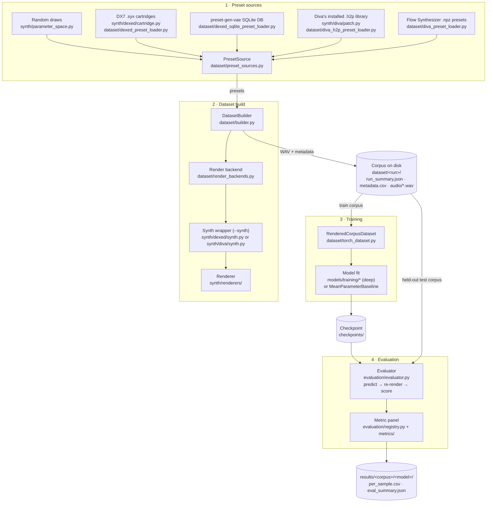

# Architecture — pipeline and module map

The framework renders synthesizer presets to audio — Dexed (DX7) and u-he Diva
(D-DIVA-START), selected per run via `--synth` — trains models to predict the parameters
back from that audio, and scores the predictions with a fixed metric panel. This doc
answers "what file does what, and in which order does data flow through them".

It states facts only. The *why* behind a design lives in [`DECISIONS.md`](DECISIONS.md)
(referenced inline by ID, e.g. D-REPRO); project terms are defined in
[`CONTEXT.md`](CONTEXT.md).

## Pipeline

```mermaid
flowchart TD
    subgraph SOURCES["1 · Preset sources"]
        RAND["Random draws<br>synth/parameter_space.py"]
        SYX["DX7 .syx cartridges<br>synth/dexed/cartridge.py<br>dataset/dexed_preset_loader.py"]
        SQL["preset-gen-vae SQLite DB<br>dataset/dexed_sqlite_preset_loader.py"]
        DIVAH2P["Diva's installed .h2p library<br>synth/diva/patch.py<br>dataset/diva_h2p_preset_loader.py"]
        DIVANPZ["Flow Synthesizer .npz presets<br>dataset/diva_preset_loader.py"]
        SRC["PresetSource<br>dataset/preset_sources.py"]
        RAND --> SRC
        SYX --> SRC
        SQL --> SRC
        DIVAH2P --> SRC
        DIVANPZ --> SRC
    end

    subgraph BUILD["2 · Dataset build"]
        BUILDER["DatasetBuilder<br>dataset/builder.py"]
        BACKEND["Render backend<br>dataset/render_backends.py"]
        WRAPPER["Synth wrapper (--synth)<br>synth/dexed/synth.py or synth/diva/synth.py"]
        ENGINE["Renderer<br>synth/renderers/"]
        BUILDER --> BACKEND --> WRAPPER --> ENGINE
    end

    SRC -- "presets" --> BUILDER

    CORPUS[("Corpus on disk<br>dataset/&lt;run&gt;/<br>run_summary.json · metadata.csv · audio/*.wav")]
    BUILDER -- "WAV + metadata" --> CORPUS

    subgraph TRAIN["3 · Training"]
        DS["RenderedCorpusDataset<br>dataset/torch_dataset.py"]
        FIT["Model fit<br>models/training/* (deep)<br>or MeanParameterBaseline"]
        DS --> FIT
    end

    CORPUS -- "train corpus" --> DS
    CKPT[("Checkpoint<br>checkpoints/")]
    FIT --> CKPT

    subgraph EVAL["4 · Evaluation"]
        EVALUATOR["Evaluator<br>evaluation/evaluator.py<br>predict → re-render → score"]
        PANEL["Metric panel<br>evaluation/registry.py + metrics/"]
        EVALUATOR --> PANEL
    end

    CKPT --> EVALUATOR
    CORPUS -- "held-out test corpus" --> EVALUATOR
    RESULTS[("results/&lt;corpus&gt;/&lt;model&gt;/<br>per_sample.csv · eval_summary.json")]
    PANEL --> RESULTS
```

A typical full run, script by script:

1. `scripts/build_dataset.py` (or `scripts/build_presetgen_corpus.py`) — build a corpus
   under `dataset/<run-name>/`.
2. `scripts/fit_model.py --model <family>` — fit any registered model family on the train
   corpus, save a checkpoint.
3. `scripts/evaluate.py` — load the checkpoint, score it on the held-out corpus, write
   `results/<corpus>/<model>/`.

Steps 1 and 3 need the corpus's synth VST locally (they render audio); step 2 does not —
it reads only the corpus on disk, so training can run on a cluster.

Every step can be driven either from the terminal (the scripts above) or from the local
Streamlit **dashboard**, which builds and subprocesses the exact same commands. See the
`dashboard/` section below.

## Module map

### `config.py`

Loads `.env` into module constants: VST paths, sample rate, note/render durations, output
directories. Everything else reads paths from here, never from `.env` directly.

### `synth/` — the synthesizer layer

| File | Purpose |
| --- | --- |
| `base_synth.py` | `BaseSynthesizer`, the interface every synth wrapper implements: get/set parameters by name, render mono audio, expose a `ParameterSpace`. |
| `parameter_space.py` | `ParameterSpace` + `ParameterSpecification`: the ordered set of estimated parameters and the two-way conversion between the synth-side dict (names → floats) and the ML-side vector (continuous values + one-hot blocks). Also owns `loss_slices` (routing for losses/metrics) and uniform sampling. |
| `dexed/synth.py` | `DexedWrapper`, the concrete Dexed implementation. Addresses parameters by plugin-reported name (D-NAMING) and delegates all rendering to a pluggable `Renderer`. |
| `dexed/subset.py` | The locked 103-parameter Dexed subset (D1). Builds the project's `ParameterSpace` from a live wrapper. |
| `dexed/cartridge.py` | Parses DX7 `.syx` cartridges (32-voice bulk dumps) into named Dexed parameter dicts, normalized the way Dexed normalizes them. |
| `diva/synth.py` | `DivaWrapper`, the second synthesizer (u-he Diva, D-DIVA-START). Diva's plugin-reported names collide (e.g. six parameters called `Rate`), so parameters are addressed by **module-qualified name** (`'VCF1.Model'`) resolved through the static table in `diva/parameters.py` — VST3 never reports the owning module. DawDreamer-only (Pedalboard drops the colliding names and shifts every index). `render_audio` issues one discarded ~0.3 s warm-up render before the scored one, to absorb Diva's own parameter-smoothing rather than the previous patch's tail (see D-DIVA-RENDER). |
| `diva/parameters.py` | `DIVA_PARAMETER_NAMES`: the static, committed index→module-qualified-name table (position in the list is the plugin index), derived from the Flow Synthesizer project and checked against the live plugin at wrapper construction. |
| `diva/subset.py` | The locked 237-of-281-parameter Diva subset (D-DIVA-SUBSET). Builds the project's `ParameterSpace` from a live `DivaWrapper`, the same shape as `dexed/subset.py`. |
| `diva/h2p_param_map.py` | `H2P_PARAMETER_MAP`: the static, committed `(module, .h2p key) -> Decoding` table (parameter name + `linear`/`grid`/`label`/`index` decode kind), derived by `scripts/derive_diva_h2p_map.py` from the live plugin's display grids and the whole local `.h2p` preset library. Never recomputed at import time, for the same reason `parameters.py` isn't. |
| `diva/patch.py` | `parse_h2p` (reads a `.h2p` file's `#cm=` sections into `{module: {key: raw_value}}`, stopping at the binary tail) and `patch_parameters` (decodes through `h2p_param_map.py` into module-qualified names → normalized `[0, 1]` floats). |
| `plugin_output.py` | `suppressed_plugin_output` / `silence_plugin_output_from_now_on`: fd-level stdout+stderr suppression, needed because Diva logs to stdout as well as stderr and logs again from its destructor at process teardown (Dexed keeps its own narrower `suppressed_stderr` in `dexed/synth.py` rather than importing this — see the module docstring for why). |
| `renderers/base.py` | `Renderer`, the only engine-specific layer: enumerate parameters, set one by index, render a note. |
| `renderers/dawdreamer_renderer.py` | Default engine, backed by DawDreamer. The only renderer Diva supports. |
| `renderers/pedalboard_renderer.py` | Second engine, backed by Pedalboard; used to cross-check Dexed renders (D-RENDERER). Never mixed with DawDreamer within a run. |

### `dataset/` — corpus building and loading

| File | Purpose |
| --- | --- |
| `preset_sources.py` | `PresetSource` decides *which* presets exist: synthetic (random draws), human (real presets projected onto the subset), or hybrid (a blend). Deterministic in the master seed. |
| `builder.py` | `DatasetBuilder` renders a `PresetSource` into a corpus: one WAV + one metadata row per preset, plus `run_summary.json`. Re-runs with the same seed are bit-identical. |
| `render_backends.py` | *How* each render runs: `RenderSettings` (the render contract) plus a registry-backed `make_wrapper(renderer, synth_name)` (`dexed` / `diva`) and the render backends — `InProcessRenderBackend` (fast, reused wrapper), `FreshProcessRenderBackend` (one spawned worker per render at position 0, D-REPRO), and parallel variants `Parallel{Fresh,InProcess}RenderBackend` (opt-in via `--workers`, SynthRL's RL reward path; not validated against Diva). Diva always takes the fresh-process path (D-DIVA-RENDER) regardless of `--fresh-process`, since it does not reproduce in-process at all. |
| `preset_loader_common.py` | The synth-agnostic half every human-preset loader shares: `LoadedPreset`, near-twin deduplication on the subset projection, the seeded train/test split, and `restrict_to_realized` (drops subset parameters a preset source never varies — the corpus-variance rule under D-DIVA-SUBSET). Only the file reading is synth-specific. |
| `dexed_preset_loader.py` | Loads `.syx` cartridge voices via `preset_loader_common`. |
| `dexed_sqlite_preset_loader.py` | Same job for the ~30k-voice preset-gen-vae DX7 SQLite database (`paper_repos/preset-gen-vae/`). |
| `diva_preset_loader.py` | Loads the Flow Synthesizer `diva_raw.zip` collection (11,218 `.npz` presets, one per file) via `preset_loader_common`. Names are matched onto `synth/diva/parameters.py` by string (the corpus writes `'VCF1: Model'`, this project `'VCF1.Model'`); the shipped audio is discarded and every preset is re-rendered under this project's own contract. Realizes only 58 of 237 subset parameters (it was itself generated by varying 64 continuous parameters off one fixed base patch), which is why it is no longer the default. |
| `diva_h2p_preset_loader.py` | Loads u-he's own installed `.h2p` preset library (factory + `THIRD PARTY`, 1432 files) via `preset_loader_common`, decoding through `synth/diva/patch.py`. The default Diva human source (`--preset-format h2p` on `scripts/build_dataset.py`) since D-DIVA-START's 2026-08-30 amendment: real, hand-made presets realize 226 of 237 subset parameters at 300 presets, against `diva_preset_loader.py`'s fixed 58. |
| `torch_dataset.py` | `RenderedCorpusDataset`: PyTorch view of a corpus on disk, emitting `(raw waveform, ML-side target vector)` pairs. Rebuilds the `ParameterSpace` from `run_summary.json`, so no VST is needed (D-SELFDESC). Feature extraction is each model's own job. |

`scripts/build_dataset.py` takes `--synth {dexed,diva}` (default `dexed`) on every
subcommand. Built corpora land under `dataset/<run-name>/` (gitignored).

### `models/` — the model families

| File | Purpose |
| --- | --- |
| `base_model.py` | `BaseModel`, the contract every family implements: `fit` / `predict` / `save` / `load`. Says *what* a model does, not how it trains. |
| `base_deep_model.py` | Shared base for deep families: checkpoint save/load and the `predict` decode path over an injected network. Subclasses provide the architecture and `fit`. |
| `mean_parameter_baseline.py` | Predicts the training-set mean parameter vector no matter the input audio. The floor every family must beat. |
| `sound2synth.py` | `Sound2SynthSpectrogramRegressor`, the first real deep family (Sound2Synth lineage, issue #19). A VGG11-BN conv net over a log-power STFT of the target audio, emitting the ML-side vector through `ParameterSpace`. A deliberately *basic* first cut — a single spectrogram branch plus a plain MLP head, **not** the paper's multi-modal encoder or grouped-FC parameter classifier (that fuller architecture is future work). |
| `presetgen_vae/` | The preset-gen-vae port (Le Vaillant et al. DAFx 2021, issues #23/#35/#36), a package with one file per role: `network.py` (mel-dB front-end + the paper's `speccnn8l1_bn` VAE with its latent RealNVP flow), `realnvp.py` (plain-torch port of the paper's flow, used both on the latent and as one family's regressor head), `families.py` (the registered wrappers `PresetGenVAEMLPRegressor` / `PresetGenVAEFlowRegressor` — the paper's two reported models, differing only in the head), `lightning_module.py` (the training-only VAE loss recipe, lazily imported). Map: `docs/PRESETGEN_VAE_PORT.md`. Convention: a paper port that outgrows one file becomes such a subpackage. |
| `inversynth2/` | The InverSynth II port (Barkan et al. ISMIR 2023), the **neural-proxy** family, a package with one file per role: `network.py` (encoder + the training-only differentiable synthesizer-proxy), `families.py` (the paper's three staged models as registered families — `IS`, `IS2xITF`, `IS2`, an ablation ladder; note `x` reads *excluding* ITF), `lightning_module.py` (the Stage 2/3 combined-loss recipe). The proxy is training-only, so `predict` re-renders with the real Dexed (D-EVAL / D-REPRO). Map: `docs/INVERSYNTH2_PORT.md`. |
| `flow_matching/` | The flow-matching port (Hayes et al. ISMIR 2025), the **conditional-generative** family and the only one built around synthesizer symmetry: `flow_matching.py` (rectified path, minibatch-OT pairing, classifier-free guidance, RK4 sampler — framework-agnostic), `encoder.py` (`AudioSpectrogramTransformer`, the conditioning encoder — *not* the paper's AST regression baseline, which is deliberately not ported), `vector_field.py` (`ConditionalResidualMLPField`, the non-equivariant control; `Param2TokProjection` + `DiffusionTransformerBlock` + `EquivariantTransformerField`, the approximately permutation-equivariant one), `network.py` (`FlowMatchingNetwork`), `families.py` (`FlowMatchingMLP` / `FlowMatchingParam2Tok`), `lightning_module.py`. The first true **sampler**: `predict` integrates the learned ODE for one seeded sample rather than doing a forward pass (D-FLOW-PREDICT), and it trains on its own synthetic-uniform corpus (D-FLOW-CORPUS). Map: `docs/FLOW_MATCHING_PORT.md`. |
| `synthrl/` | The SynthRL port (Shin & Lee IJCAI-25), the **reinforcement-learning** family: `representation.py` (the family-local **class-index representation** — every parameter becomes a classification head, numerical ones discretized onto 25 ordinal levels; wraps `ParameterSpace`, never modifies it), `network.py` (`SynthRLNetwork`: mel front-end → strided conv → transformer encoder → DETR decoder with one learnable query per parameter → per-parameter class heads), `families.py` (two of the paper's three stages — `SynthRLp`, parameter loss only; `SynthRLi`, in-domain RL warm-started from a `-p` checkpoint via `--init-from`. Stage 3 `SynthRL-o` is deferred on D-FAMILIES), `lightning_module.py` (Gaussian-smoothed class cross-entropy; REINFORCE + reward-prioritized replay), `reward.py` / `reward_buffer.py`. The only family that **renders with the live VST inside the training loop** (D-RL-RENDER): a `SynthRLi` training run needs Dexed, though `predict` and the eval path stay VST-free. Map: `docs/SYNTHRL_PORT.md`. |
| `registry.py` | `MODEL_REGISTRY`: name → (model class, default checkpoint filename) for every family. The single source of truth `fit_model.py --model` and `evaluate.py --model` both read, so a new family registers once and is trainable and evaluable everywhere. |

### `models/training/` — the PyTorch-Lightning training harness

| File | Purpose |
| --- | --- |
| `config.py` | `TrainingConfig`: typed, frozen config parsed from a dict or `training_config.yaml`. Unknown keys fail at parse time. |
| `data_module.py` | Train (and optional validation) DataLoaders over a `RenderedCorpusDataset`; validation comes from an explicit corpus or a seeded split. |
| `lightning_module.py` | Wraps an injected `nn.Module` with the training recipe: step functions, optimizer, logging, and the parameter loss. Exists during training only. |
| `loss.py` | `ParameterLoss`: MSE/MAE on continuous parameters, cross-entropy on one-hot blocks, routed by `ParameterSpace.loss_slices`. |
| `trainer_factory.py` | Builds the `pl.Trainer`: checkpointing (best + last), optional early stopping, CSV logging, SLURM auto-requeue. |
| `checkpoint.py` | The exported inference checkpoint: one torch file with weights, architecture hyperparameters, and the serialized `ParameterSpace`. Loads without Lightning, training data, or a VST. |

### `evaluation/` — scoring

| File | Purpose |
| --- | --- |
| `registry.py` | `METRIC_PANEL`: 13 per-sample metric specs across the parameter, magnitude, timbre, loudness, and pitch axes. Holds specs; never runs them. |
| `metrics/parameter.py` | Parameter-axis metrics over ML-side vectors (secondary/diagnostic). |
| `metrics/audio_based.py` | Audio metrics over raw waveforms: spectral magnitude, MFCC timbre, loudness, and F0 pitch. Embedding-based perceptual metrics are out of scope (D-METRIC-PERCEPTUAL). |
| `evaluator.py` | `Evaluator`: per corpus sample, predict → re-render the prediction fresh-process (D-REPRO) → run the panel. Writes `results/<corpus>/<model>/{per_sample.csv, eval_summary.json}`. Reads the render contract **and the synth** from the corpus, never from `config.py` (D-EVAL); a corpus built before the second synth carries no `"synth"` key and defaults to Dexed. |

Outputs under `results/` and `checkpoints/` are gitignored.

### `scripts/` — entry points

| Script | What it does |
| --- | --- |
| `verify_dexed.py` | Smoke-test: renders a random patch through the local VST, writes a verification WAV, exits non-zero on failure. |
| `render_preset.py` | Renders one voice of a `.syx` cartridge to WAV for listening. |
| `build_dataset.py` | CLI around `DatasetBuilder`: build a synthetic, human, or hybrid corpus. `--synth {dexed,diva}` (default `dexed`) picks the synthesizer; `--preset-format {h2p,npz}` (default `h2p`) picks Diva's human source; `--workers N` parallelizes fresh-process partitions across worker processes without changing the rendered audio. |
| `build_presetgen_corpus.py` | Builds a training corpus from the preset-gen-vae SQLite collection. |
| `fit_model.py` | Fits any registered model family (`--model`) on a corpus, saves the checkpoint `evaluate.py` loads. |
| `evaluate.py` | Runs a checkpoint through the `Evaluator` on a corpus; writes the results table. |
| `benchmark_renderers.py` | D-RENDERER experiment: speed and audio agreement of the three render strategies (reuse, reload, Pedalboard). |
| `measure_context_leakage.py` | D-RENDERER experiment: tests whether cross-engine divergence is within-engine context leakage. |
| `render_divergence_examples.py` | D-RENDERER experiment: renders the most divergent patches through all three strategies for side-by-side listening. |
| `measure_diva_warmup.py` | D-DIVA-RENDER experiment: measures Diva's render-opening contamination (parameter-smoothing crossfade from the previous patch) across a warm-up sweep; `--synth dexed` runs the same probes against Dexed as a control. |
| `derive_diva_h2p_map.py` | Derives `synth/diva/h2p_param_map.py`: sweeps the live plugin's display grids, scans every `.h2p` preset under `config.DIVA_PRESETS_PATH`, and runs a per-module bipartite assignment (value compatibility as a hard filter, name similarity as the ranker) to resolve each `.h2p` key onto its parameter. `--write-map` regenerates the committed table; otherwise prints the report (coverage, contested rows). |

### `dashboard/` — the local control panel

A private, localhost Streamlit front-end over the pipeline scripts (build → fit → evaluate →
browse results). It **subprocesses** the `scripts/*.py` commands and reads their output files
back for display; it never imports the pipeline library, so it cannot drift from the CLI. The
D1 subset is shown read-only — the forms expose only the per-run knobs the scripts already
take. Run with `streamlit run dashboard/app.py`.

| File | Purpose |
| --- | --- |
| `app.py` | Streamlit entrypoint: home page with environment status (VST present?, render contract, corpus/checkpoint/result counts) and the sidebar that links the four pages. |
| `script_specs.py` | Declarative `ArgSpec` / `ScriptSpec` tables transcribed from each script's `argparse`. One spec per build source (synthetic/human/hybrid/presetgen), and evaluate; `MODEL_CHOICES` mirrors `models.registry.MODEL_REGISTRY`'s keys as plain strings (checked against drift by a test, since the dashboard never imports the pipeline). Adding a future script = append one spec. Training moved off this seam (see `cluster_runner.py`) once fitting became cluster-only. |
| `forms.py` | `render_form(spec)` draws a widget per arg and returns the argv list; `build_command(spec, values)` is the pure, unit-tested spec→argv core. Required-but-blank fields raise before anything runs. |
| `command_runner.py` | `run_streaming` launches the subprocess and streams stdout into a live log box, re-collapsing `\r`/`\n` on every chunk (`collapse_carriage_returns`) so `tqdm` bars update in place on one line; `run_capture` is the blocking variant used by tests. `collapse_carriage_returns` is also reused to render one-shot polled remote-log-tail snapshots (no state carried between polls). |
| `cluster_runner.py` | Drives the PUT SLURM cluster over SSH (D-DASHBOARD-CLUSTER): `load_cluster_env` reads `cluster/cluster.env`, `git_guard_status` warns on uncommitted/unpushed local state, `submit_job` pushes the corpus (`cluster/push_corpus.sh`), `git pull`s the remote checkout, and `sbatch`s `cluster/train.sbatch`, recording the result in the local, gitignored `cluster/jobs.json` job registry (`load_jobs`/`append_job`). `get_slurm_job_state` polls SLURM job state, `get_remote_log_tail` reads the tail of `slurm-<jobid>.out` over SSH, `cancel_job` runs `scancel`, and `pull_checkpoint` wraps `cluster/pull_checkpoint.sh`. |
| `discovery.py` | Scans `config.py` paths for dropdown options: `list_corpora` (dirs with `run_summary.json`, flagged fresh-process for D-REPRO), `list_checkpoints`, `list_result_runs`, plus per-run saved-audio lookups (`list_saved_audio_samples`, `original_audio_path`, `predicted_audio_path`) for the Results page's Listen section. |
| `ui.py` | Shared widgets: `command_preview` (copyable command) and `run_button` (streams a run, reports the exit code). |
| `env.py` | Path bootstrap so pages import both the project and dashboard modules. |
| `pages/1_Build_dataset.py` | Pick a preset source → per-run form → build; shows the D1 subset read-only, then the new corpus's `run_summary.json` and a WAV preview. |
| `pages/2_Train_on_cluster.py` | Pick a corpus + model family + training config → push the corpus and submit a SLURM job on the cluster. Lists jobs submitted from this dashboard, each in an expander: PENDING/RUNNING jobs get a `st.fragment(run_every="5s")`-polled live log tail and a Cancel button, COMPLETED jobs get a Pull checkpoint button, other terminal states show an error banner with the log tail. |
| `pages/3_Evaluate.py` | Pick a checkpoint + a (fresh-process) corpus → evaluate; warns when the VST is missing or the corpus is in-process (not D-REPRO). Optionally saves a seeded random sample of prediction audio for the Results page's Listen section. |
| `pages/4_Results.py` | The metric × (corpus/model) benchmark table from every `eval_summary.json`, a per-run `per_sample.csv` drill-down with per-metric histograms, and a Listen section for A/B'ing target vs. predicted audio. |

### Everything else

- `tests/` — pytest suite; tests that need the Dexed VST skip automatically when it is absent
  (`test_dashboard_forms.py` covers the spec→argv, runner, and discovery pieces with no Streamlit runtime).
- `figures/` — thesis figure scripts plus the shared matplotlib style (`style.py`; contract in `docs/figure-style.md`).
- `paper_repos/` — read-only reference code from related papers (InverSynth2, preset-gen-vae); also where the DX7 SQLite database ships.
- `docs/` — `DECISIONS.md` (design decisions and rationale), `CONTEXT.md` (glossary), `ROADMAP.md` (phases), `walkthroughs/` (PR-sized deep dives).
