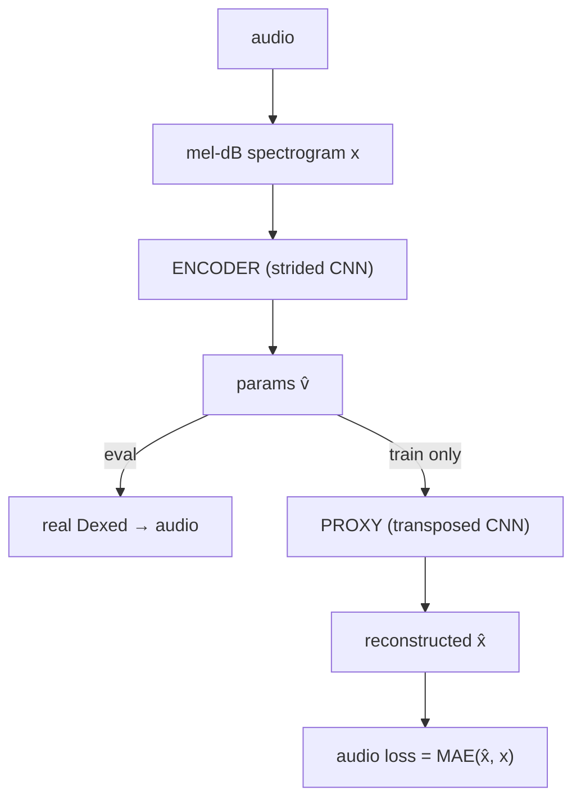
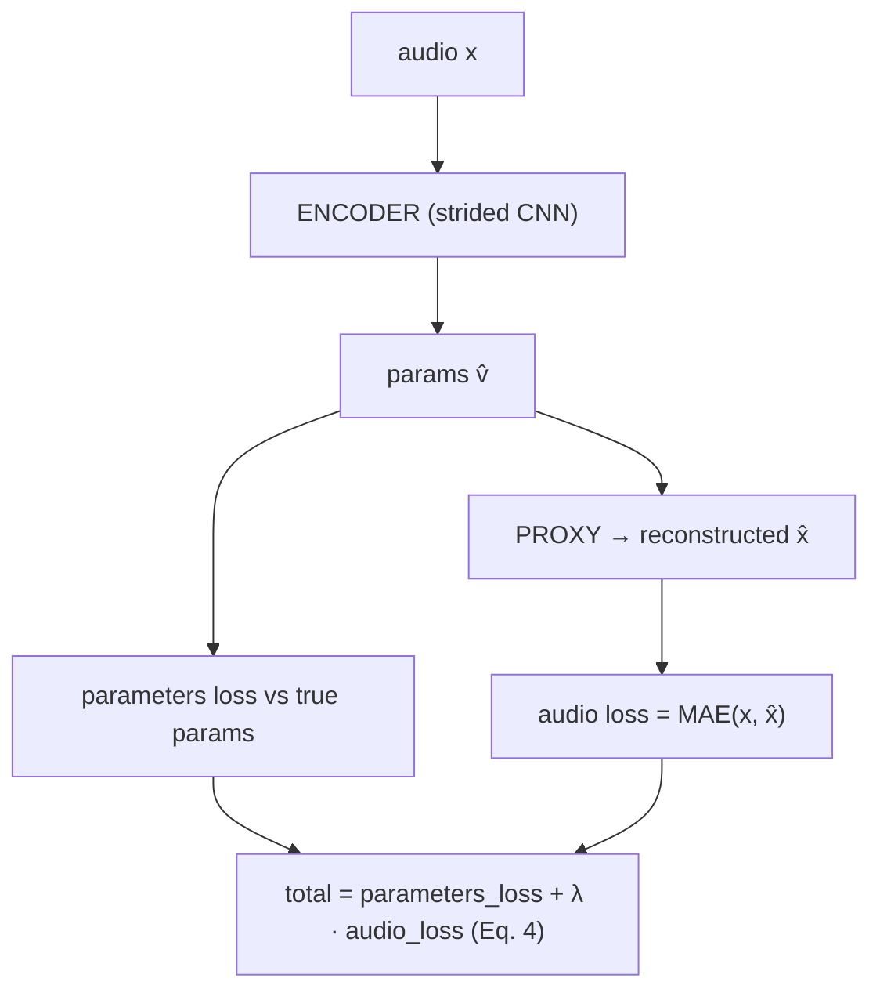

# The InverSynth II port — networks, models, and modules

How the paper *"InverSynth II: Sound Matching via Self-Supervised Synthesizer-Proxy"* (Barkan et
al., ISMIR 2023, `paper_repos/InverSynth2/`) maps onto the code in the `models/inversynth2/`
package — one paper, one package, one file per role: `network.py` (front-end + encoder + proxy),
`families.py` (the registered model wrappers), and `lightning_module.py` (the training-only loss
recipe). Read this if the split between "network", "model", and "module" is unclear, or you want to
know which class is which part of the paper. Design rationale (D1, D-MELNORM, D-FRAMEWORK,
D-SELFDESC, D-EVAL, D-REPRO) lives in `docs/DECISIONS.md`; this doc is just the map.

InverSynth II fills the benchmark's **neural-proxy** family slot — a peer paper approach alongside
the discriminative (Sound2Synth) and generative (preset-gen-vae) families, **not** a baseline.

## Three words that mean different things

The nets get wrapped for different jobs. Keep them straight:

| Word | What it is | Examples |
|------|-----------|----------|
| **network** | The raw neural net — layers + a `forward`. Pure PyTorch. | `InverSynthEncoderNetwork`, `IS2Network` |
| **model / family** | The benchmark wrapper: `fit` / `save` / `load` / `predict`. What the pipeline scripts drive. | `IS`, `IS2xITF`, `IS2` |
| **(Lightning) module** | A *training-time-only* wrapper defining the loss + training step. Discarded after `fit`. | `LightningIS2Regressor` |

One **model** contains one **network** and, only while training, hands it to one **module**.

## The paper stacks THREE models — an ablation ladder

Unlike the preset-gen-vae port (one architecture in many configurations), InverSynth II is genuinely
**three stacked models**, each adding one thing to the last. They are the paper's own ablation
ladder, so each is independently reportable in the benchmark, and each is a registered family under
the paper's own name:

| Stage | Family | What it is | New over the prior stage |
|-------|--------|-----------|--------------------------|
| 1 | `IS` | A spectrogram → parameters encoder, parameters loss only (the InverSynth I approach). | — |
| 2 | `IS2xITF` | `IS`'s encoder plus a training-only differentiable **synthesizer-proxy** and an audio loss. | + proxy + audio loss (Eq. 4) |
| 3 | `IS2` | The full model: `IS2xITF` **with** per-sample **inference-time finetuning** (ITF). | + ITF at predict time (Eq. 6) |

### The naming trap: `xITF` means *excluding* ITF

`IS2xITF` is the paper's own label. The **`x` reads *excluding***: it is the `IS2` model **without**
inference-time finetuning, i.e. Stage 2. It is **not** "IS2 times ITF" or "IS2 with ITF". Stage 3,
the full model with ITF, is plain `IS2`. Get this backwards and the whole ladder inverts.

### The proxy is a training-only component

The key fact that keeps this port simple. The synthesizer-proxy (Stages 2–3) is a differentiable
neural stand-in for Dexed. It exists **solely to supply gradients** for the audio loss during
training. `predict` always returns a synth-dict and the `Evaluator` re-renders every prediction with
the **real** Dexed (D-EVAL / D-REPRO). The proxy never touches evaluation. So adding it does not
disturb the eval path at all.

## The one architecture underneath all three

Two nets, ported in `network.py`:

The encoder always runs; its raw output vector `v̂` (continuous floats + categorical logits) has two
consumers — the real synth at eval, the training-only proxy at training:



- **Encoder** (`InverSynthEncoderNetwork`) — the reference `encdec.py::Encoder`: six strided convs
  (1 → 8 → 16 → 32 → 64 → 128 → 256; first kernel 5×5, the rest 4×4, all stride 2, LeakyReLU 0.1, no
  batch-norm on the first conv), then a feature mixer (256 → 512 stride-2, then a 512 → 2048 1×1
  conv), then a `Dropout → Linear → BatchNorm1d` head to the `ml_dimension` raw outputs that
  `ParameterLoss` consumes. This is the whole of `IS`, and the eval path of every stage.
- **Proxy** (`InverSynthProxyNetwork`) — the reference `encdec.py::Decoder`: a transposed-CNN that
  maps the encoder's predicted vector back to a normalized mel-dB spectrogram, so an audio loss can
  push gradients into the encoder. Training-only.

`IS2Network` pairs the two: `forward(audio)` is the encoder alone (the eval path), and
`forward_training(audio)` additionally runs the proxy and returns an `IS2NetworkOutput` (prediction +
proxy spectrogram + the input spectrogram to compare against). Both nets are optimized by one
optimizer, jointly, exactly as the paper trains them (Eq. 4).

## Training vs inference flow

**Training** (`IS2xITF` / `IS2`, identical) — encoder + proxy active. The predicted `v̂` feeds both
the parameters loss (against the true params) and the proxy, and the two losses are summed:



`IS` is the same picture with the proxy and audio term removed (parameters loss only).

**Inference** — the proxy is **dropped**; `predict` re-renders with the real Dexed:

- `IS` / `IS2xITF`: `x → encoder → v̂ → synth-dict → load into Dexed`. The inherited
  `BaseDeepModel.predict`, unchanged, because `IS2Network.forward` is the encoder alone.
- `IS2`: same, but ITF first adapts the encoder to *this one* target before decoding (next section).

The proxy exists only to shape the encoder during training. At predict time you go audio → parameters
and the Evaluator renders those parameters on real Dexed.

## Inference-time finetuning (ITF) — what `IS2` adds

For each test waveform `x_t`, `IS2.predict` runs the paper's Eq. 6 before decoding. It freezes the
proxy `phi*`, snapshots the encoder `theta*`, and takes `itf_steps` (default 30) Adam steps on the
encoder minimizing:

```
L_t  +  lambda_B · L_B
```

- **`L_t`** = `MAE(proxy(encoder(x_t)), spectrogram(x_t))` — the self-supervised audio loss on the
  single test example. This is the finetuning signal: bend the encoder so the proxy reconstructs
  *this* sound.
- **`L_B`** = the Eq. 4 combined loss (`ParameterLoss` + lambda · proxy audio loss) over a random
  batch of a **training pool cached at `fit` time**. The anchor that stops the encoder from
  overfitting the single test example and forgetting its training.

The best-scoring step is kept and the encoder is restored to `theta*` afterwards, so ITF is
per-sample and leaves the model unchanged for the next call (guaranteed by
`IS2._itf_encoder_session`, which reloads `theta*` even if a step raises).

**Step selection — the real-synth monitor.** The paper selects the best step and decides "did ITF
help?" by monitoring the *real* synthesizer (its `L_t^f`), not the proxy. `predict` gets that monitor
through `IS2.set_itf_render_callback(synth_dict -> waveform)`: when the `Evaluator` (which owns the
corpus render contract, D-EVAL) injects a callback, each step is scored by rendering the current
prediction on real Dexed and taking the MAE between its mel-dB spectrogram and the target's. Only the
*gradient* still flows through the frozen proxy — the synth is not differentiable; the real synth is
used solely to pick the step and to keep `theta*` when no step improves.

**VST-free fallback.** With no callback set (a direct `predict`, or the VST-free cluster), selection
falls back to the **proxy** audio loss `L_t`. Because proxy and synth differ, a proxy-selected step
is not guaranteed to lower the real-synth metric the Evaluator reports — the discrepancy the
real-synth monitor removes.

This is why `IS2` evaluation is much slower than the other families: per test sample it runs ~30 Adam
steps plus ~31 real-synth renders (one per candidate step), where every other model does a single
forward pass. It is inherent to ITF, not a bug.

## How the code maps onto this

| Stage | Network | Model (family) | Trained by | Checkpoint carries |
|-------|---------|----------------|------------|--------------------|
| 1 | `InverSynthEncoderNetwork` | `IS` | stock `LightningRegressor` (`ParameterLoss` only) | encoder |
| 2 | `IS2Network` | `IS2xITF` | `LightningIS2Regressor` (combined loss) | encoder + proxy |
| 3 | `IS2Network` | `IS2` | `LightningIS2Regressor` (same as Stage 2) | encoder + proxy + ITF pool + Eq. 4 loss knobs |

`IS2` subclasses `IS2xITF`: training is **identical** (same network, same combined loss), because ITF
is inference-only. `IS2` only overrides `predict` (to run ITF) and extends the checkpoint (via
`_extra_checkpoint_state` / `_restore_extra_checkpoint_state`) to carry the training pool `L_B` needs.
An `IS2xITF` checkpoint therefore cannot be loaded as `IS2` — it lacks the pool, and `load` says so.

Registered in `models/registry.py`:

```python
"IS":      ModelRegistration(IS,      "inversynth_is.pt"),
"IS2xITF": ModelRegistration(IS2xITF, "inversynth_is2xitf.pt"),
"IS2":     ModelRegistration(IS2,     "inversynth_is2.pt"),
```

so each is independently trainable (`scripts/fit_model.py --model`) and evaluable
(`scripts/evaluate.py --model`), mirroring the paper's ablation ladder. Training hyperparameters:
`cluster/training_configs/inversynth2_config.yaml` (one recipe serves all three stages).

## Walkthrough: our code ↔ the paper's code

Piece-by-piece counterpart map. Ours under `models/inversynth2/`, paper under
`paper_repos/InverSynth2/`. Line numbers are as of this writing; names are the stable reference.

**No weight-transplant parity tests** (unlike the preset-gen-vae port). The shipped reference is the
FM/TAL variant only (`Python code/FM Synth/encdec.py`); the paper's **DX7** encoder/decoder file is
absent from the repo. So this port adapts the FM/TAL *topology* and drives the mixed
continuous+categorical head through our `ParameterSpace`, and is checked by shape / round-trip /
behavioral tests (`tests/test_inversynth2.py`), not by transplanting the paper's weights.

| Piece | Ours | Paper |
|---|---|---|
| audio → mel-dB spectrogram | `network.py` reuse of `models/presetgen_vae/network.py::_compute_mel_db_spectrogram` + `_build_mel_filterbank` | not in the FM/TAL repo (its spectrograms are precomputed upstream) |
| dB min/max normalization endpoints | `families.py` `measure_corpus_mel_db_range` (D-MELNORM) | InverSynth II uses a fixed dB range (deviation, below) |
| encoder conv body (enc_nn + features_mixer_cnn) | `network.py` `_build_encoder_cnn` | `encdec.py::Encoder.enc_nn` (17–40) + `features_mixer_cnn` (42–49) |
| one conv block (conv → LeakyReLU → BN) | `network.py` `_conv2d_block` | inline in `encdec.py::Encoder` |
| encoder head (Dropout → Linear → BatchNorm1d) | `network.py` `InverSynthEncoderNetwork.head` | `encdec.py::Encoder.mlp` (51–55) |
| flattened-feature width | probed with a dummy render-length input (`_infer_cnn_output_shape`) | hardcoded `Linear(12288, …)` (`encdec.py:53`) for the FM/TAL input size |
| proxy (transposed CNN) | `network.py` `InverSynthProxyNetwork`, reusing `presetgen_vae` `_build_decoder_cnn` + `_center_crop_or_pad` | `encdec.py::Decoder` (66–116) |
| proxy reshape / un-mixer sizing | sized from the encoder's probed feature-map shape | hardcoded `Linear(104, 24576)` + `view(-1, 2048, 3, 4)` (`encdec.py:71, 113`) |
| encoder + proxy assembly | `network.py` `IS2Network` (`forward` = encoder; `forward_training` = both) | `encdec.py::EncDec` (126–151) |
| benchmark wrapper (fit/save/load/predict) | `families.py` `IS` / `IS2xITF` / `IS2` (via `models/base_deep_model.py`) | none — the repo drives the raw nets directly |
| Stage 1 training (params loss only) | stock `models/training/lightning_module.py::LightningRegressor` | the reference's own training script |
| Stage 2 training step + combined loss | `lightning_module.py` `LightningIS2Regressor._shared_step` | the paper's Eq. 4 |
| parameters loss (CE + L2) | `models/training/loss.py` `ParameterLoss` | the paper's parameters loss (equal average of CE + L2) |
| proxy audio loss (MAE) | `F.l1_loss(proxy_spectrogram, target_spectrogram)` in `_shared_step` | the paper's proxy audio loss (Eq. 4, lambda) |
| inference-time finetuning (Eq. 6) | `families.py` `IS2._finetune_to_target` / `predict` | the paper's Eq. 6 (no code in the FM/TAL repo) |
| real-synth step monitor (`L_t^f`) | `families.py` `IS2.set_itf_render_callback`, injected by `evaluation/evaluator.py::_attach_itf_monitor` | the paper's real-synth model selection |
| hyperparameters | `cluster/training_configs/inversynth2_config.yaml` | the paper's Section 3.2 |

## Deviations from the paper

Intentional, dictated by our framework contract and by what the shipped repo provides:

- **Reused mel-dB front-end.** The encoder featurizes audio with the **preset-gen-vae** front-end
  (257 mels, n_fft 1024, hop 256, fmin 30, fmax 11000, min-max normalized to [-1, 1]), reused as the
  deliberate cross-paper reuse the plan calls for. This matches InverSynth II's DX7 spectrogram
  configuration closely, but the exact DX7 numbers are not in the shipped repo (only the FM/TAL
  variant ships), so this is "the same *kind* of front-end", not a verified match.
- **Corpus-stat dB normalization, not a fixed dB range.** InverSynth II normalizes with a fixed dB
  min/max; we reuse preset-gen-vae's corpus-measured endpoints (`measure_corpus_mel_db_range`,
  D-MELNORM), folded into the checkpoint so `load` rebuilds the identical front-end offline.
- **Proxy is the preset-gen-vae decoder builder, not a line-for-line port of the reference
  `Decoder`.** The reference `Decoder` hardcodes its reshape and transposed-conv dims for the FM/TAL
  shape. This port reuses `presetgen_vae`'s shape-robust decoder (`_build_decoder_cnn` inverts the
  identical CNN topology), sizes the un-mixer `Linear` from the encoder's probed feature-map shape,
  and crops/pads the output to the exact `(n_mels, frames)` target with `_center_crop_or_pad`, so the
  audio loss is well-defined at any render length. Same topology family, robust dims.
- **Probed shapes, not magic numbers.** The reference hardcodes `Linear(12288, …)` (encoder) and
  `view(-1, 2048, 3, 4)` (decoder) for its input size. We probe the conv stack with a dummy
  render-length input at build time and size the linear layers from the result — robust to our
  257×N, ~4 s input.
- **Raw output head, no `PresetActivation`.** The proxy consumes the encoder's **raw** ML-side vector
  (continuous floats + categorical logits), not an activated preset (Hardtanh + softmax) — the same
  raw contract the encoder head emits for `ParameterLoss`, as `Sound2SynthSpectrogramRegressor` and
  the preset-gen-vae families do. The initial proxy `Linear` absorbs the scale.
- **Checkpoint selection on `val_loss`, not the paper's real-synth Eq. 5.** The cluster is VST-free
  (D-SELFDESC), so model selection uses the same objective measured through the proxy: `val_loss` is
  the parameters loss for `IS` and the combined loss for `IS2xITF` / `IS2`. The final *scored*
  evaluation still runs on real Dexed. For `IS2` the paper's real-synth *ITF step* selection is
  preserved on the Mac (the render-callback monitor above); only the training-time checkpoint
  selection deviates.
- **Optimizer / schedule / split.** Adam betas (0.9, 0.999) vs the paper's (0.9, 0.99); cosine LR
  decay from 1e-4 vs the paper's 1e-4 → 1e-6 schedule; a single seeded 10% validation split vs the
  paper's cross-validation. All are config-level, documented in `inversynth2_config.yaml`.

## Caveats

- Reproduced numbers will **not** match the paper's tables, by design: **103** Dexed params (D1); our
  own categorical scheme over `ParameterSpace.loss_slices`; a single train/test split; **dawdreamer**
  rendering, not the paper's toolchain; and the DX7 architecture *adapted* from the FM/TAL reference
  rather than run from the paper's own (unavailable) DX7 code. We reproduce the *method*, not the
  *numbers*.
- On the VST-free cluster, `IS2`'s ITF step selection falls back to the proxy monitor; the
  paper-faithful real-synth selection only happens when the Evaluator runs it on the Mac with the
  live VST.
